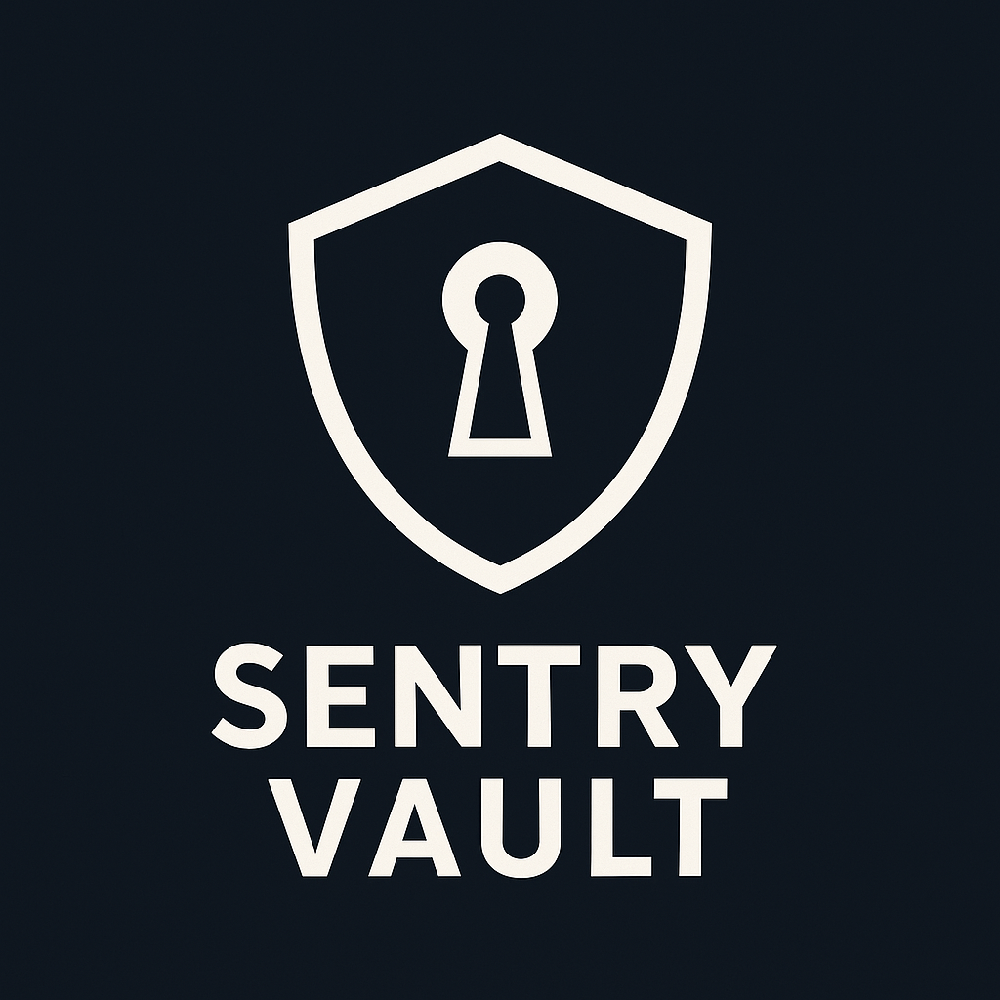

# Sentry Vault

  
_A security-focused password manager with decentralized storage and quantum-resistant encryption._

[](LICENSE)
[](#contributing)

## 🔐 About

Sentry Vault is an open-source, high-security password manager designed to:

- Protect sensitive credentials with **Argon2 + AES-128 + HMAC** encryption
- Store data in a **decentralized manner** using **Shamir's Secret Sharing**
- Use **AI-based semantic passphrases** for easy memorization
- Ensure **post-quantum security** with Kyber/KEMS (future roadmap)

## 🚀 Features

### ✅ **MVP Features**

- **Semantic Passphrase System**: Generates user-friendly yet secure passphrases.
- **Quantum-Resistant Encryption**: Argon2-based key derivation + Fernet encryption.
- **Decentralized Storage**: Shamir’s Secret Sharing (3 out of 5 shards required).
- **Basic Anomaly Detection**: Restricts access during sensitive hours.
- **CLI Interface**: Manage credentials with `add`, `get`, and `monitor` commands.

### 🔥 **Future Enhancements**

- **Biometric & Hardware Authentication**: Face ID, YubiKey support.
- **AI-Driven Security**: Behavioral analysis + anomaly detection.
- **Self-Healing Architecture**: Automated shard rotation + honeypots.
- **Zero-Knowledge Cloud Sync**: Encrypted multi-device sync.
- **Geofencing & Device Fingerprinting**: Context-aware access control.

## 🛠 Installation

### Prerequisites

- Python 3.10+
- Poetry (for dependency management)
- OpenSSL (for cryptographic operations)

### Setup

```bash
# Clone the repository
git clone https://github.com/agspades/sentry-vault.git
cd sentry-vault

# Install dependencies
poetry install && poetry env activate

# Run the CLI
poetry run sentryvault
```

## 📜 Usage

```bash

```

## 🧑‍💻 Contributing

Contributions are **welcome**! Please read our [CONTRIBUTING.md](CONTRIBUTING.md) and sign the [CLA](CONTRIBUTOR_LICENSE_AGREEMENT.md) before submitting a PR.

## 📄 License

Sentry Vault is licensed under the [AGPL-3.0](LICENSE) license. For commercial use, please contact us.

## ⭐ Support the Project

If you find this useful, consider giving it a ⭐ on GitHub!

---

🔒 _"Security isn’t a feature—it’s the foundation."_
