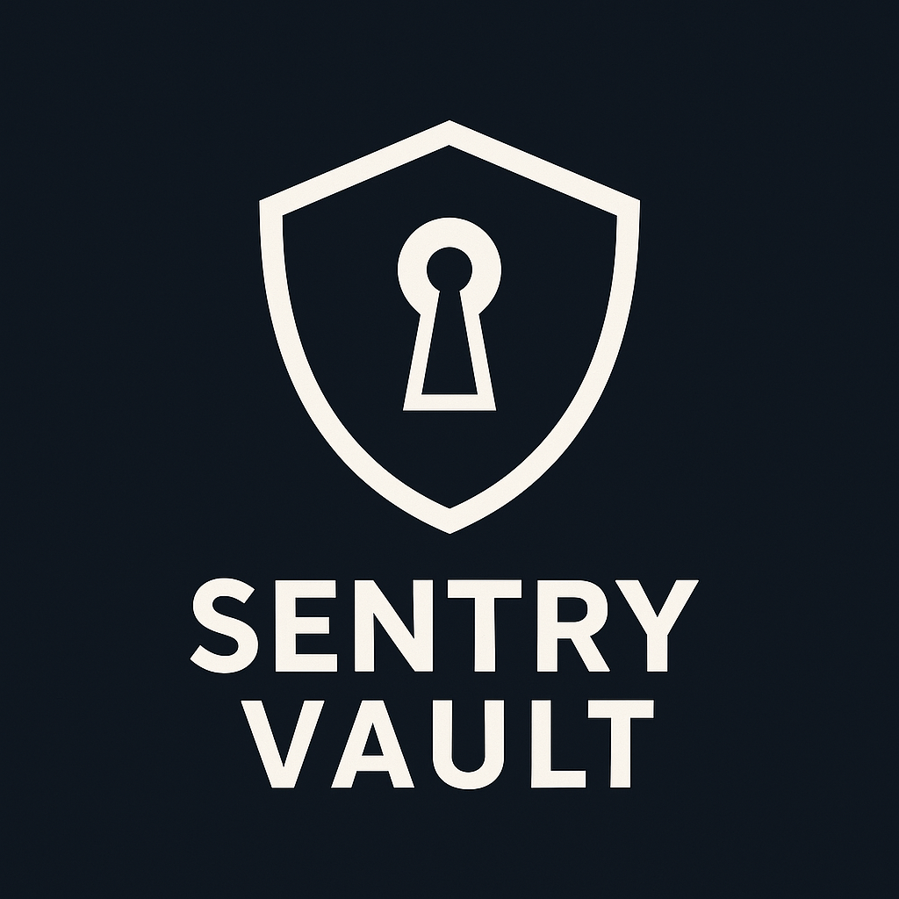

# Sentry Vault

  
_A security-focused local password manager with optional sharded storage._

[](LICENSE)
[](https://www.python.org/downloads/)
[](https://github.com/psf/black)

## 🔐 About

Sentry Vault is an open-source, high-security password manager designed with privacy and security as its core principles. It provides a secure way to store and manage your credentials while ensuring that you remain in full control of your data.

### 🔑 Core Security Features

- **Strong Encryption**: Uses Argon2id for key derivation and Fernet for authenticated encryption
- **Sharded Storage**: Uses Shamir's Secret Sharing to split encrypted vault data into threshold-based shares
- **Zero-Knowledge Architecture**: Your master password never leaves your device
- **Passphrase Generation**: Create random, memorable, or PIN-style credentials from the CLI

## 🚀 Features

### 🔒 Core Functionality

- **Secure Credential Storage**: Store usernames and passwords in an encrypted local vault
- **Sharded Vaults**: Optional threshold-based sharding using Shamir's Secret Sharing
- **Rich CLI Interface**: Beautiful terminal interface with colorized output and progress bars
- **Password Generator**: Built-in tool for creating strong, random passwords
- **Secure File Encryption**: Encrypt/decrypt files using the same strong cryptography

### 🛡️ Security Features

- **Argon2** for key derivation (memory-hard and resistant to GPU/ASIC attacks)
- **Fernet authenticated encryption** for confidentiality and integrity
- **HMAC** for data integrity verification
- **Per-vault salt handling** persisted with encrypted vault payloads

## 🛠 Installation

### Prerequisites

- Python 3.10 or higher
- Poetry (for dependency management)
- OpenSSL (for cryptographic operations)

### Quick Start

```bash
# Clone the repository
git clone https://github.com/agspades/sentry-vault.git
cd sentry-vault

# Install dependencies
poetry install

# Activate the virtual environment
poetry env activate

# Run the CLI
poetry run sentryvault --help
```

## 📜 Usage

### Basic Commands

```bash
# Add a new credential
poetry run sentryvault add example.com username

# Retrieve a credential
poetry run sentryvault get example.com

# List all stored entries
poetry run sentryvault list

# Remove a credential
poetry run sentryvault delete example.com

# Change your master passphrase
poetry run sentryvault change-passphrase

# Generate a secure password
poetry run sentryvault generate-password --length 20
```

### File Encryption

```bash
# Encrypt a file
poetry run sentryvault encrypt sensitive.txt sensitive.enc

# Decrypt a file
poetry run sentryvault decrypt sensitive.enc sensitive_decrypted.txt
```

## 🔧 Advanced Usage

### Password Generation Options

```bash
# Generate a random password with specific requirements
poetry run sentryvault generate-password --length 20

# Generate a memorable passphrase and copy to clipboard
poetry run sentryvault generate-password --type memorable -c
```

## 🛡️ Security Best Practices

1. **Use a Strong Master Password**: Choose a long, random passphrase
2. **Enable Sharding**: Distribute shards across multiple secure locations
3. **Regular Backups**: Keep regular backups of your vault in secure locations
4. **Secure Environment**: Only run Sentry Vault on trusted, secure systems
5. **Keep Software Updated**: Regularly update to the latest version for security patches

## 🧑‍💻 Contributing

We welcome contributions! Please read our [Contribution Guidelines](CONTRIBUTING.md) and sign the [Contributor License Agreement](CONTRIBUTOR_LICENSE_AGREEMENT.md) before submitting pull requests.

### Development Setup

```bash
# Install development dependencies
poetry install --with dev

# Run tests
poetry run pytest

# Format code
poetry run black .

# Check types
poetry run mypy .
```

## 📄 License

Sentry Vault is licensed under the [GNU Affero General Public License v3.0](LICENSE). This is a strong copyleft license that ensures any modifications to the software must be released under the same license.

## ⭐ Support the Project

If you find Sentry Vault useful, please consider:

- Giving us a ⭐ on GitHub
- Reporting bugs or suggesting features
- Contributing code or documentation
- Spreading the word to others who might find it useful

---

🔒 _"In a world of digital threats, your security is our mission."_
